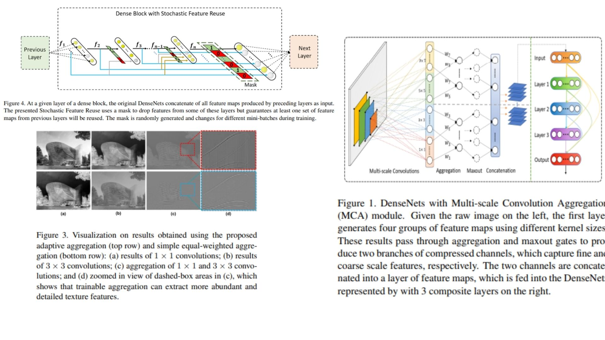

# 🌌 DenseNet-MCA-SFR PyTorch Implementation

This repository contains a replication of **DenseNet with Multi-scale Convolution Aggregation (MCA) and Stochastic Feature Reuse (SFR)** using PyTorch. The goal is to reproduce a **DenseNet-121 architecture** enhanced with MCA and SFR for improved feature extraction and regularization.

- Implemented **DenseNet-121** with MCA and SFR modules.  
- Architecture follows:  
**Conv1 → MCA → SFR → DenseBlock1 → Transition1 → DenseBlock2 → Transition2 → DenseBlock3 → Transition3 → DenseBlock4 → BN → ReLU → AvgPool → Flatten → FC**  
**Paper**: [Multi-scale Convolution Aggregation and Stochastic Feature Reuse for DenseNets](https://arxiv.org/abs/XXXX.XXXXX)

---

## 🖼 Overview – DenseNet-MCA-SFR Architecture

  

- **Figure 1:** Dense connectivity pattern. Each layer in a dense block receives feature-maps from all previous layers via concatenation, which improves gradient flow and enables feature reuse.  
- **Figure 3:** Multi-scale Convolution Aggregation (MCA) module. Multi-scale filters (1×1, 3×3, 5×5, 7×7) are aggregated with trainable gating weights and maxout to extract richer features.  
- **Figure 4:** Stochastic Feature Reuse (SFR) regularization. Randomly drops some feature reuse paths during training to reduce overfitting while ensuring at least one set of previous features is reused.  
- **Transition Layers:** 1×1 convolutions followed by 2×2 average pooling reduce spatial size and optionally compress channels between dense blocks.  
- **Final Layers:** BatchNorm → ReLU → AdaptiveAvgPool → Flatten → Fully Connected for classification.

> DenseNet-MCA-SFR extends DenseNet by adding multi-scale feature extraction at the input stage and stochastic feature reuse inside dense blocks. MCA enriches the input representation, while SFR acts as a regularizer, making the network more robust and improving generalization on various datasets.


---

## 🏗 Project Structure

```bash
DenseNet-MCA-SFR/
│
├── src/
│   ├── layers/
│   │   ├── dense_layer.py          # Single dense layer: BN → ReLU → Conv3x3 + concat previous feature-maps
│   │   ├── multi_scale_layer.py    # Multi-scale convolution aggregation: 1x1, 3x3, 5x5, 7x7 + maxout
│   │   ├── stochastic_reuse.py     # Stochastic Feature Reuse mask
│   │   ├── transition_layer.py     # 1x1 Conv + AvgPooling
│   │   ├── conv1.py                # Initial 7x7 Conv
│   │   ├── pool_layers/
│   │   │   ├── maxpool_layer.py    # MaxPool after conv1
│   │   │   └── avgpool_layer.py    # Global Average Pooling after last block
│   │   ├── flatten_layer.py        # Conv → FC transition
│   │   └── fc_layer.py             # Fully Connected Layer (1000 classes)
│   │
│   ├── blocks/
│   │   ├── dense_block.py          # Dense block with MCA + SFR integration
│   │   └── transition_block.py     # Transition block with 1x1 Conv + AvgPool
│   │
│   ├── model/
│   │   └── densenet_ms_sr.py       # DenseNet121 backbone + MCA + SFR
│   │
│   └── config.py                    # Hyperparameters: growth_rate, reuse_prob, block layers
│
│
├── requirements.txt
└── README.md
```
---

## 🔗 Feedback

For questions or feedback, contact: [barkin.adiguzel@gmail.com](mailto:barkin.adiguzel@gmail.com)
